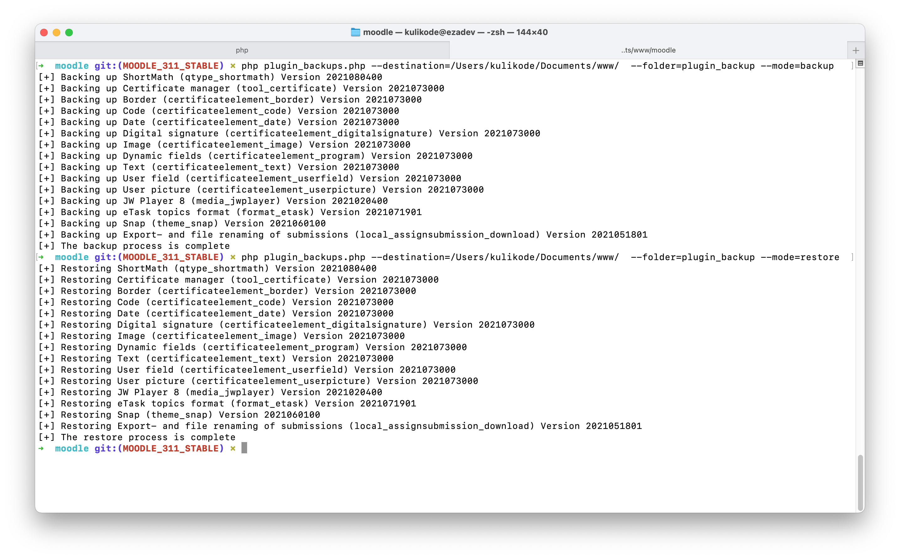

# Backup and Restore Additional Moodle Plugin



upgrading Moodle site never been easy job, based on Moodle standar Upgrading guide, we can't copy new files over the old files, that mean we have to move all installed additional plugin to new moodle version directory, This plugin only aims to backup and restore for additional (contribonly) plugins installed on Moodle so we don't need to manually move plugins during the Moodle upgrade process. after we move the additional plugin to original folder then let moodle do the upgrade thing for those plugin if necessary

## How to use

### Backup

Make sure you on the root directory of installed moodle. this process will copy the additional plugin to `--folder` alongsite with their `metadata` in json `format` for restore purposes

```
wget https://raw.githubusercontent.com/khairu-aqsara/moodle_contribonly_plugin_backup/main/plugin_backups.php
chmod +x plugin_backups.php
sudo -u www-data php plugin_backups.php --destination=/var/www/html --folder=plugin_backup --mode=backup
```

### Restore

Make sure you on the root directory of new version of installed moodle and before doing upgrade process. this process will copy the additional plugin from `--folder` to new installed moodle folder based on plugin metadata `rootdir`

```
wget https://raw.githubusercontent.com/khairu-aqsara/moodle_contribonly_plugin_backup/main/plugin_backups.php
chmod +x plugin_backups.php
sudo -u www-data php plugin_backups.php --destination=/var/www/html --folder=plugin_backup --mode=restore
```
example of plugin metadata

```json
{
  "type":"assignfeedback",
  "name":"structured",
  "typerootdir":"/var/www/html/moodle/mod/assign/feedback",
  "rootdir":"/var/www/html/moodle/mod/assign/feedback/structured",
  "displayname":"Structured feedback",
  "versiondisk":2019061100
}
```

### Tested on

```
Moodle 3.5, 3.6, 3.7, 3.8, 3.9
```
